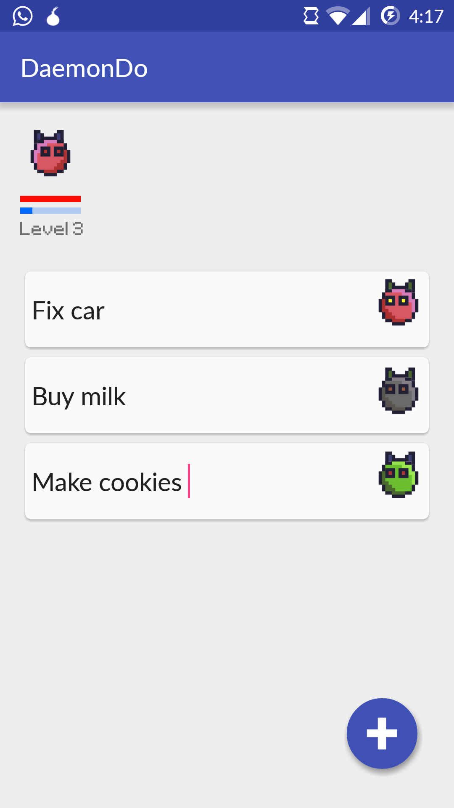

# DaemonDo
DaemonDo is a lightweight yet elegant task list which features a minimalistic material design.
It keeps the user motivated by implementing a simple rpg feature: the user has to keep its daemon alive
by doing the tasks he previously set. The more tasks are dismissed, the more is the experience gain.
Once a daemon dies, another one (with random colors) replaces it.

Get it on Google Play: https://play.google.com/store/apps/details?id=com.daemondo.mike.daemondo

